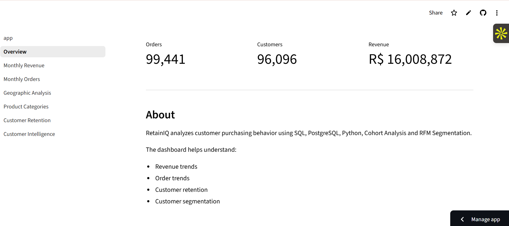
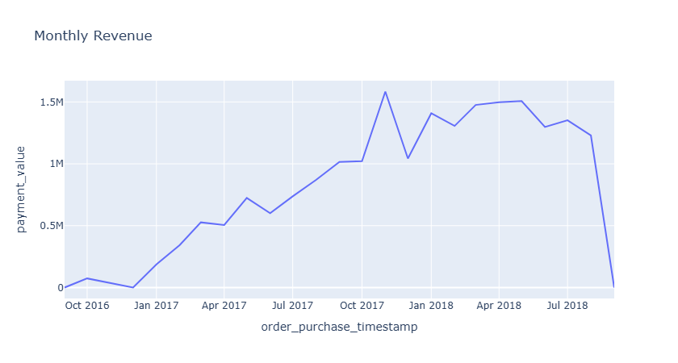
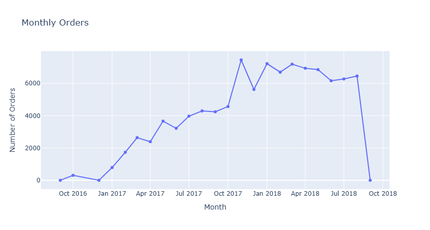
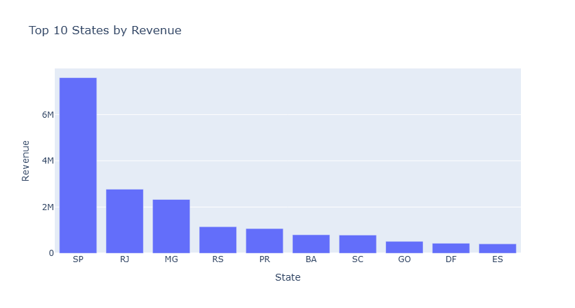
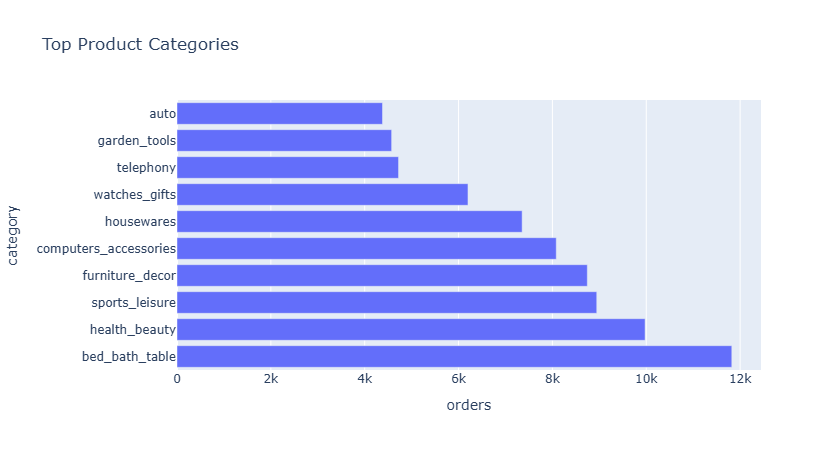

# 📊 RetainIQ – Customer Intelligence Dashboard

A complete end-to-end customer analytics project built using SQL, Python, PostgreSQL and Streamlit to analyze purchasing behavior, revenue trends, customer retention, and product performance from the Brazilian E-Commerce dataset.

**🌐 Live Demo:** [https://retainiq-customer-analytics.streamlit.app](url)

## Dashboard Preview


### Overview


### Monthly Revenue


### Monthly Orders


### Geographic Analysis


### Product Categories


---

# Project Objective

Businesses generate thousands of transactions every day, but raw data alone cannot answer important business questions.

RetainIQ transforms raw transactional data into business insights by answering questions such as:

- Which months generated the highest revenue?
- How are orders changing over time?
- Which states generate the most revenue?
- Which product categories perform best?
- Which customers are likely to return?
- How can customers be segmented using RFM Analysis?

---

# Tech Stack

- Python
- PostgreSQL
- SQL
- Pandas
- Plotly
- Streamlit
- Jupyter Notebook

---

# Project Workflow

```
Raw Dataset
      │
      ▼
SQL Data Cleaning
      │
      ▼
PostgreSQL Database
      │
      ▼
Python Data Analysis
      │
      ▼
Cohort Analysis
      │
      ▼
RFM Segmentation
      │
      ▼
Interactive Streamlit Dashboard
```

# Features

## Executive Dashboard

- KPI Cards
- Total Revenue
- Total Customers
- Total Orders

---

## Revenue Analytics

- Monthly Revenue Trend
- Peak Revenue Identification
- Revenue Growth Analysis

---

## Order Analytics

- Monthly Order Volume
- Purchasing Trends
- Seasonal Analysis

---

## Geographic Analysis

- Revenue by State
- Top Performing Locations

---

## Product Analytics

- Top Product Categories
- Revenue Distribution
- Category Performance

---

## Customer Analytics

- Cohort Retention Analysis
- RFM Segmentation
- Customer Lifetime Insights

---

# Project Structure

```
retainiq-customer-analytics
│
├── dashboard
│   ├── app.py
│   └── pages
│       ├── 1_Overview.py
│       ├── 2_Monthly_Revenue.py
│       ├── 3_Monthly_Orders.py
│       ├── 4_Geographic_Analysis.py
│       └── 5_Product_Categories.py
│
├── data
│   └── processed
│
├── notebooks
│
├── sql
│
├── images
│
├── requirements.txt
│
└── README.md
```

---

# Business Insights

- Identified highest revenue generating months.
- Measured monthly purchasing patterns.
- Ranked states based on customer revenue.
- Discovered highest performing product categories.
- Segmented customers using RFM Analysis.
- Evaluated customer retention using Cohort Analysis.

---

# Skills Demonstrated

- SQL
- PostgreSQL
- Data Cleaning
- Exploratory Data Analysis
- Data Visualization
- Dashboard Development
- Business Intelligence
- Customer Analytics
- Cohort Analysis
- RFM Segmentation
- Streamlit
- Plotly
- Pandas

---

# Dataset

Brazilian E-Commerce Public Dataset (Olist)

https://www.kaggle.com/datasets/olistbr/brazilian-ecommerce

---

# Run Locally

Clone the repository

```bash
git clone https://github.com/shreysexperience/retainiq-customer-analytics.git
```

Install dependencies

```bash
pip install -r requirements.txt
```

Run Streamlit

```bash
streamlit run dashboard/app.py
```

# Future Improvements

- Customer Lifetime Value (CLV)
- Demand Forecasting
- Customer Churn Prediction
- Interactive Filters
- Downloadable Reports
- ML-powered Recommendation Engine

GitHub:
https://github.com/shreysexperience

LinkedIn:
www.linkedin.com/in/shreyb717
---

⭐ If you found this project useful, consider giving it a star.
